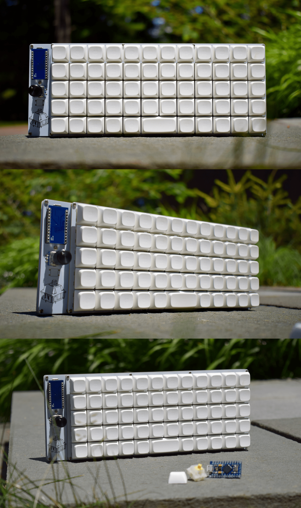
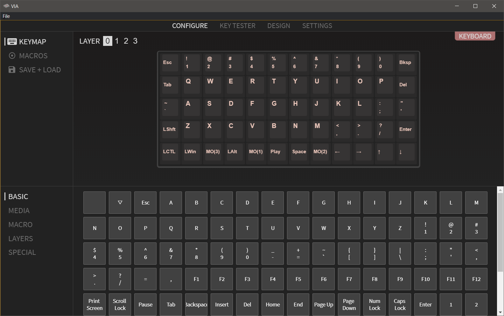
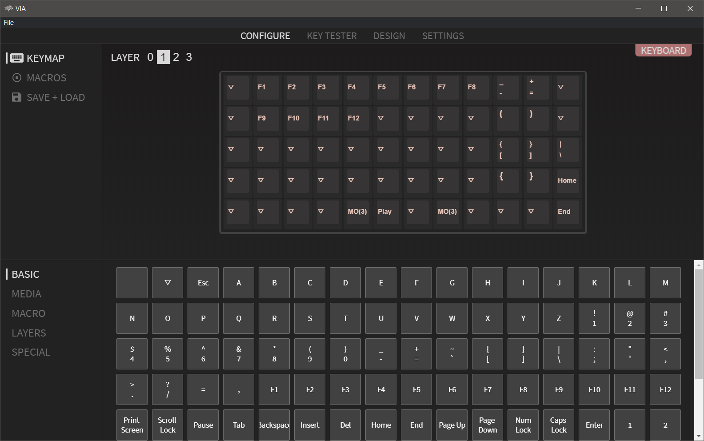
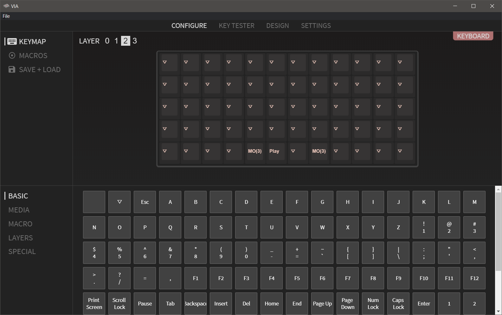

# WhiteBoard

## A Budget-Oriented Ortholinear Keyboard

Current Version 1.1 - Adds support for pcb mount stabilizers, makes the design easier to assemble, and decreases price of production

Planned Improvements - Add support for an acrylic window for the components on the left

## Features
- Rotary Encoder
- Hot Swappable switches
- QMK and VIA support (Not upstream)
- Easy Assembly (Can be made entirely through hole)
- Budget Oriented
- Compatible with a variety of Microcontrollers

## Make Your Own
[Parts List](PartsList.md)

## Images

## Default Keymap

